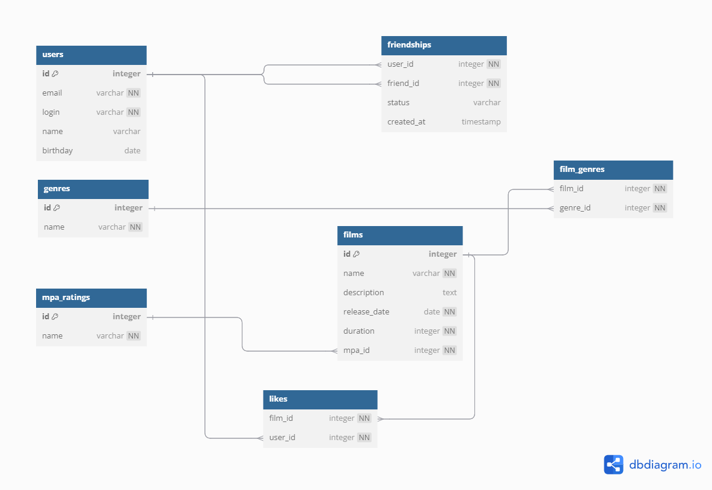

# Filmorate - Схема базы данных

## 📌 ER-диаграмма базы данных
Ниже представлена схема базы данных нашего приложения:



## 🔍 Описание схемы

- **users** — хранит информацию о пользователях.
- **friendships** — хранит связи дружбы между пользователями (подтвержденные/неподтвержденные).
- **films** — содержит информацию о фильмах.
- **genres** — список жанров, связанных с фильмами через `film_genres`.
- **mpa_ratings** — возрастные рейтинги фильмов.
- **likes** — хранит лайки фильмов от пользователей.

## 📌 Примеры SQL-запросов

### 1️⃣ **Добавить нового пользователя**
```sql
INSERT INTO users (email, login, name, birthday)
VALUES ('user@email.com', 'user123', 'John Doe', '1995-06-15');
```

### 2️⃣ **Добавить фильм**
```sql
INSERT INTO films (name, description, release_date, duration, mpa_id)
VALUES ('Inception', 'Sci-fi thriller', '2010-07-16', 148, 3);
```

### 3️⃣ **Поставить лайк фильму**
```sql
INSERT INTO likes (film_id, user_id)
VALUES (1, 2);
```

### 4️⃣ **Получить топ-5 популярных фильмов**
```sql
SELECT f.id, f.name, COUNT(l.user_id) as likes_count
FROM films f
LEFT JOIN likes l ON f.id = l.film_id
GROUP BY f.id
ORDER BY likes_count DESC
LIMIT 5;
```

### 5️⃣ **Найти общих друзей двух пользователей**
```sql
SELECT u.*
FROM users u
JOIN friendships f1 ON u.id = f1.friend_id
JOIN friendships f2 ON u.id = f2.friend_id
WHERE f1.user_id = 1 AND f2.user_id = 2 AND f1.status = 'confirmed' AND f2.status = 'confirmed';
```

### 6️⃣ **Получить список всех фильмов с их жанрами и рейтингом**
```sql
SELECT f.id, f.name, f.description, f.release_date, f.duration, m.name AS mpa_rating, GROUP_CONCAT(g.name) AS genres
FROM films f
JOIN mpa_ratings m ON f.mpa_id = m.id
LEFT JOIN film_genres fg ON f.id = fg.film_id
LEFT JOIN genres g ON fg.genre_id = g.id
GROUP BY f.id, m.name;
```

### 7️⃣ **Добавить дружбу (приглашение в друзья)**
```sql
INSERT INTO friendships (user_id, friend_id, status)
VALUES (1, 2, 'pending');
```

### 8️⃣ **Подтвердить дружбу**
```sql
UPDATE friendships
SET status = 'confirmed'
WHERE user_id = 2 AND friend_id = 1;
```

### 9️⃣ **Удалить дружбу**
```sql
DELETE FROM friendships
WHERE (user_id = 1 AND friend_id = 2) OR (user_id = 2 AND friend_id = 1);
```

---


